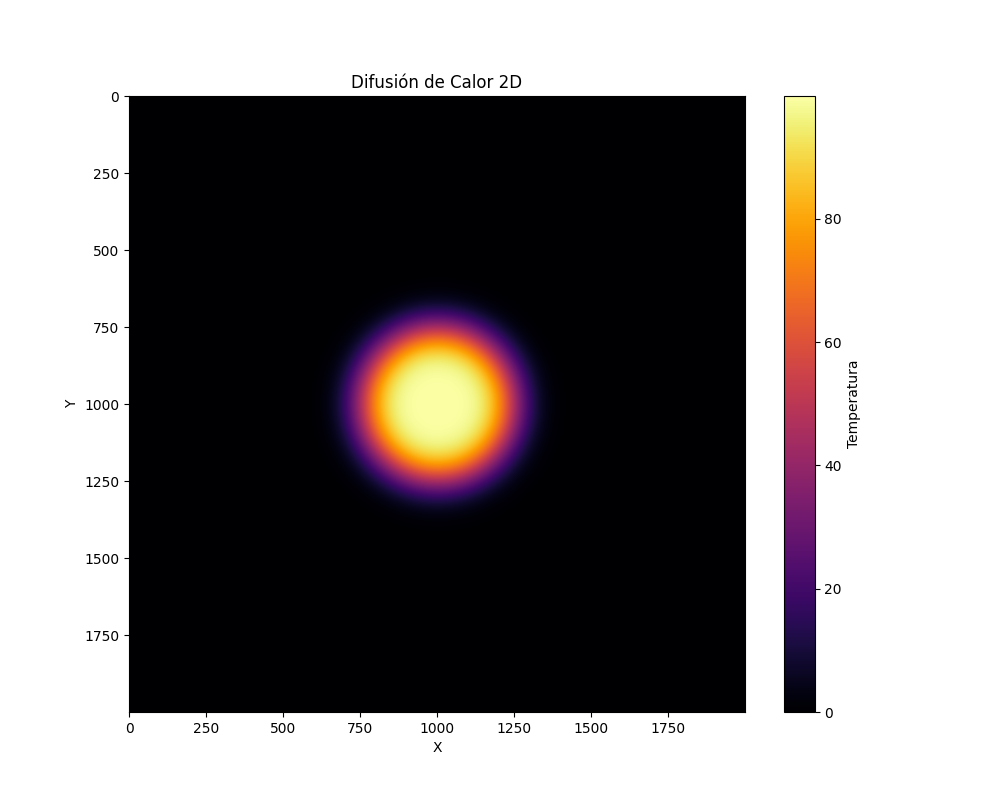

# 2D Heat Diffusion Simulation (HPC Project)

Simulación numérica de la Ecuación de Calor en 2D implementada en C++ utilizando técnicas de computación de alto rendimiento (HPC). El proyecto compara el rendimiento entre ejecución serial, paralelismo de memoria compartida (**OpenMP**) y paralelismo de memoria distribuida (**MPI**) sobre arquitectura Apple Silicon (M1).

## 🚀 Características
- **Método Numérico:** Diferencias Finitas (Finite Difference Method) con stencil de 5 puntos.
- **Implementaciones:**
  - Serial (Base optimizada con flattened arrays).
  - OpenMP (Multithreading con `collapse` y `schedule` estático).
  - MPI (Domain Decomposition con intercambio de filas fantasma/ghost rows).
- **Visualización:** Script de Python para generación de mapas de calor.

## 📊 Análisis de Rendimiento (Benchmark)
Pruebas realizadas en **MacBook Air M1 (8 Cores: 4 Performance + 4 Efficiency)**.
Grid: 2000x2000 | Iteraciones: 4000

| Implementación | Núcleos/Procesos | Tiempo (s) | Speedup | Notas |
|----------------|------------------|------------|---------|-------|
| Serial (Base)  | 1                | 23.29s     | 1.0x    | |
| OpenMP         | 4                | 6.76s      | 3.44x   | Scaling casi lineal. |
| **MPI** | **4** | **4.59s** | **5.07x** | **Speedup Superlineal** debido a mejor localidad de caché (L2/L1). |
| OpenMP         | 8                | 5.91s      | 3.94x   | Limitado por los E-cores del M1. |

> **Nota Técnica:** La implementación MPI superó a OpenMP y logró un speedup superlineal (>4x con 4 cores) debido a la descomposición de dominio. Al dividir la matriz global en sub-bloques más pequeños, cada proceso pudo mantener sus datos dentro de la caché del procesador más eficientemente que el modelo de memoria compartida monolítica.

##  Visualización

*Visualización de la difusión térmica tras 20000 iteraciones, con un punto caliente central inicial*

---

## 🛠️ Instalación y Uso

### Prerrequisitos
- Compilador GCC (para OpenMP) y MPI.
- Python 3 (para visualización).

```bash
# macOS (Homebrew)
brew install gcc open-mpi python3 numpy matplotlib
Compilación
El proyecto utiliza un Makefile para gestionar los builds:

´´´Bash

make all      # Compila todo
make serial   # Compila solo version serial
make omp      # Compila solo OpenMP
make mpi      # Compila solo MPI
make clean    # Limpia binarios
Ejecución
Bash

# Serial
./heat_serial

# OpenMP (Ej. 4 hilos)
export OMP_NUM_THREADS=4
./heat_omp

# MPI (Ej. 4 procesos)
mpirun -np 4 ./heat_mpi
´´´
---
**Autor:** Alonso Delfino Cervantes Flores
**Licencia:** MIT
