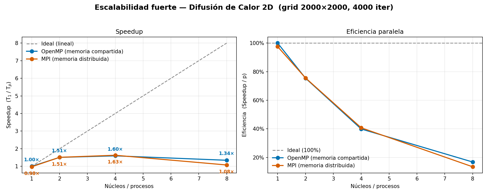
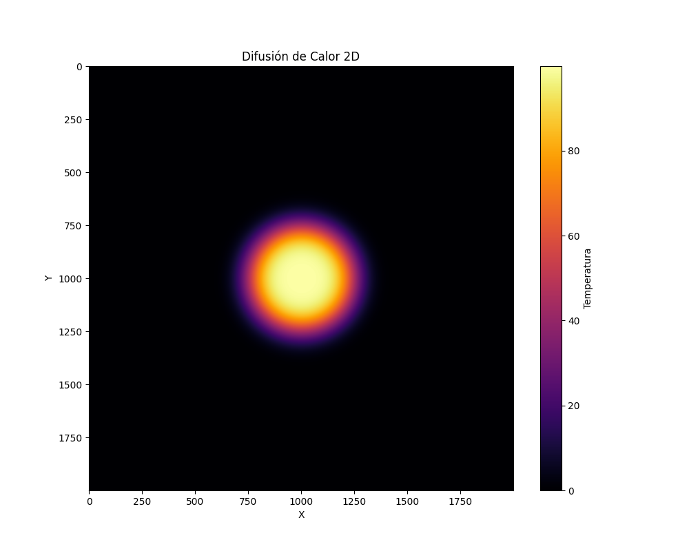

# 2D Heat Diffusion Simulation (HPC Project)


Simulación numérica de la Ecuación de Calor en 2D implementada en C++ utilizando técnicas de computación de alto rendimiento (HPC). El proyecto compara el rendimiento entre ejecución serial, paralelismo de memoria compartida (**OpenMP**) y paralelismo de memoria distribuida (**MPI**) sobre arquitectura Apple Silicon (M1).

## 🚀 Características
- **Método Numérico:** Diferencias Finitas (Finite Difference Method) con stencil de 5 puntos.
- **Implementaciones:**
  - Serial (base optimizada con *flattened arrays* y *pointer swapping*).
  - OpenMP (multithreading sobre el bucle de filas, con vectorización SIMD del bucle interno).
  - MPI (descomposición de dominio 1D con intercambio de filas fantasma / *ghost rows*).
- **Tamaño configurable sin recompilar:** vía variables de entorno `HEAT_N` y `HEAT_ITER`.
- **Benchmark reproducible:** `make bench` mide todo y `make plot` genera el gráfico de speedup.

## 📊 Análisis de Rendimiento (Benchmark)

Pruebas realizadas en **MacBook Air M1 (8 cores: 4 Performance + 4 Efficiency)**.
Grid: 2000×2000 | Iteraciones: 4000 | Compilador: `g++-15 -O3` | Mejor de 3 corridas intercaladas.



| Implementación | Núcleos/Procesos | Tiempo (s) | Speedup | Eficiencia |
|----------------|:----------------:|:----------:|:-------:|:----------:|
| Serial (base)  | 1                | 7.66       | 1.00×   | —          |
| OpenMP         | 2                | 5.07       | 1.51×   | 75%        |
| OpenMP         | 4                | 4.80       | **1.60×** | 40%      |
| OpenMP         | 8                | 5.69       | 1.34×   | 17%        |
| MPI            | 2                | 5.06       | 1.51×   | 76%        |
| MPI            | 4                | 4.70       | **1.63×** | 41%      |
| MPI            | 8                | 7.11       | 1.08×   | 13%        |

> Los números exactos dependen del estado térmico de la máquina (el M1 Air es de enfriamiento pasivo). Regenera tus propios datos con `make bench && make plot`.

### 🔎 Interpretación (por qué el speedup no es lineal)

- **El kernel está limitado por ancho de banda de memoria, no por cómputo.** El stencil de 5 puntos hace ~5 FLOPs por celda pero lee ~5 valores de memoria: intensidad aritmética muy baja. Añadir cores no ayuda una vez saturado el bus de memoria, por eso ambas versiones se estancan cerca de **1.6×** con 4 cores.
- **Con 8 cores el rendimiento cae.** Los 4 *E-cores* del M1 son mucho más lentos que los *P-cores* y, sumado a la saturación de memoria y la sobresuscripción, el tiempo empeora respecto a 4 cores.
- **OpenMP y MPI rinden casi idéntico** en esta máquina: ambos saturan el mismo recurso (memoria). La ventaja de MPI (mejor localidad por sub-bloques) se compensa con el costo del *halo exchange*.

> **Nota histórica / lección aprendida:** una versión anterior del kernel OpenMP usaba `#pragma omp parallel for collapse(2)`. Medido, `collapse(2)` hacía la versión de **1 hilo ~2× más lenta que el serial**, porque fusiona los bucles `i,j` (obligando a recuperar los índices con división/módulo por celda) y **rompe la auto-vectorización SIMD del bucle interno**. Se paraleliza únicamente el bucle externo de filas.

##  Visualización

*Visualización de la difusión térmica tras 20000 iteraciones, con una pared izquierda caliente.*

---

## 🛠️ Instalación y Uso

### Prerrequisitos
- Compilador GCC (para OpenMP) y una implementación de MPI (p. ej. Open MPI).
- Python 3 con `numpy` y `matplotlib` (para la visualización).

```bash
# macOS (Homebrew)
brew install gcc open-mpi python3
pip3 install numpy matplotlib
```

### Compilación
El proyecto usa un `Makefile`:

```bash
make all      # Compila las tres versiones
make serial   # Solo la versión serial
make omp      # Solo OpenMP
make mpi      # Solo MPI
make clean    # Limpia binarios y salidas
```

### Ejecución

```bash
# Serial
./heat_serial

# OpenMP (p. ej. 4 hilos)
OMP_NUM_THREADS=4 ./heat_omp

# MPI (p. ej. 4 procesos)
mpirun -np 4 ./heat_mpi
```

El tamaño del problema es configurable sin recompilar:

```bash
HEAT_N=512 HEAT_ITER=1000 ./heat_serial   # grid 512×512, 1000 iteraciones
```

### Benchmark y gráfico de speedup

```bash
make bench    # compila y mide serial + OpenMP + MPI  ->  output/benchmark.csv
make plot     # genera output/speedup.png a partir del CSV
```

Parámetros del benchmark (opcionales):

```bash
# corrida rápida de prueba
HEAT_N=512 HEAT_ITER=500 REPS=2 OMP_LIST="1 2 4" MPI_LIST="1 2 4" ./scripts/run_benchmark.sh
```

### Visualizar el campo de temperatura

```bash
./heat_serial                                # genera output/serial_result.csv
python3 scripts/plot_heatmap.py              # genera output/heatmap_serial.png
```

---

**Autor:** Alonso Delfino Cervantes Flores
**Licencia:** MIT
